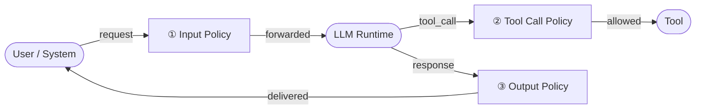

# What is APS?

**Agent Policy Specification (APS)** is a vendor-neutral standard for enforcing policies on AI agent interactions.

APS defines a standard interception layer that sits between an agent and its underlying LLM. It gives operators, developers, and platform teams a consistent way to express, evaluate, and enforce policies on every message, tool call, and model response — before any side effect occurs.

## The Problem

AI agents act on behalf of users and systems. They call tools, read data, and produce outputs — often with little or no enforcement boundary between an instruction and its consequences.

Current approaches to safety and control are fragmented: guardrails are baked into individual agent frameworks, applied inconsistently across environments, and difficult to audit or reason about independently from application logic.

## What APS Defines

APS specifies three interception points in the agent–LLM interaction lifecycle:

For each interception point, APS defines:

- **A data model** — the schema of what is evaluated
- **A policy interface** — how policies are declared, composed, and resolved
- **An enforcement contract** — what actions a compliant runtime must take on a policy decision

## Status

APS is in the **concept and specification design** phase.

| Artifact | Status |
|---|---|
| Core specification | In progress |
| Reference implementation (TypeScript) | Pre-release |
| Reference implementation (Java) | Planned |
| Conformance test suite | Planned |

## Get Involved

- Read the [specification](/spec/core)
- Contribute on [GitHub](https://github.com/agentpolicyspecification/spec)
- Join the [discussion](https://github.com/agentpolicyspecification/.github/discussions)
